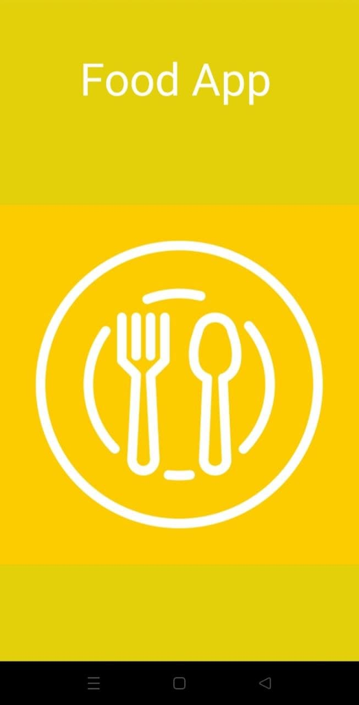

### Used libraries for building this app:

    1.REACT-NATIVE
    2.Javascript
    3.Expo
    4.Redux
    5.React-Navigation
    6.React-Native-Reanimated
    7.React Thunk
    8.expo-vector-icons

### Images:

<html>

<body>
<h2>Welcome Screen for my app.</h2>

<h2>For Menu Items</h2>

<h2>Specific foods.</h2>

<h2>Add food to favourite feature.</h2>

<h2>Favourite food list</h2>

### Video:

<video width="320" height="240" autoplay>
  <source src="./ProjectVideoImages/video_2022-05-04_01-09-50.mp4" type="video/mp4">
</video>
</body>
</html>

### To run this app on your device ,install expo cli in your device and go to this link and scan the QR code:

<a href="https://expo.dev/@avijit_chy/Restaurant_Project">Press the link...</a>
